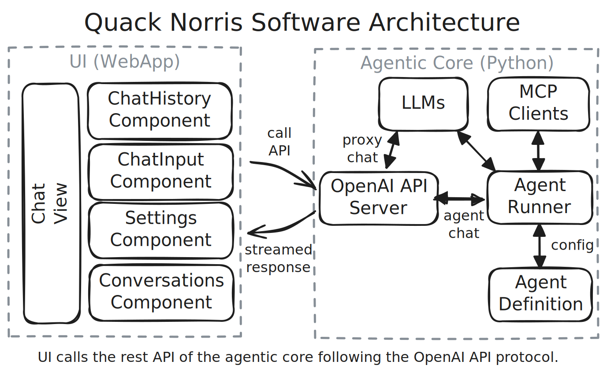

# 🦆 Quack Norris - the code savy star 🌟 


Are you tired of spending hours ⏳ debugging your code, reading papers or writing e-mails? Look no further! Quack Norris 🦆 is here to save the day. This AImazing rubber duck will be your trusty AI companion 🤖, helping you tackle anything on your PC 💻.

**Agentic AI Core**: Experience agentic AI using any language model provider through quack-norris. Define simple agents with markdown and connect MCP tools.This innovative platform allows tools and retrieval-augmented generation (RAG) functionalities to be used with ease. 🤖💬


## 👨‍💻 Usage 

1. Install git and the uv package manager on your system.
2. Clone this git repository and install quack-norris.
  ```bash
  git clone --recursive https://...
  cd quack-norris
  uv sync
  ```
3. Start quack norris (from terminal or even add the exe to autostart)
  ```bash
  uv run quack-norris
  ```

### Alternative (OpenAI API compatible UI only)

If you do not want to install the full agentic quack norris or want to access your quack norris server from your phone or a mobile device, you can just use the web app. Visit https://penguinmenac3.github.io/quack-norris/ and install it as a web app.

**Direct Ollama Support:** If you want to use ollama directly in the UI without the agentic core inbetween, you need to enable CORS, so that the app can access your local ollama.
To achieve this, add `OLLAMA_ORIGINS=*` to the environment variables.


The web app will come preconfigured with a connection to your local ollama.
In the webapp you can configure the connections in the settings in the app (top right).
There you can add any OpenAI compatible LLM provider (even a quack-norris running on a different PC).


## 💡 Roadmap

- UX / UI
  * [ ] Settings
    - [X] Configure connections to LLMs (OpenAI compatible APIs)
  * [ ] Manage Chats / Conversations
    - [X] New chat
    - [ ] Change icon for new chat
    - [X] Change model for current chat
    - [ ] Download current chat as markdown
    - [ ] Reopen old conversation
    - [ ] Delete old conversation
  * [X] Image support (allow pasting, dragging or uploading an image / screenshot)
- Server
  * [X] Agentic core loop (collect context by calling tools)
  * [ ] System tray icon and floaty for default quack-norris
    - [ ] System tray icon allows to exit/restart server and show/hide floaty
    - [ ] Floaty can be enabled disabled by default when launching (user preference)
  * [ ] `quack-norris-cli` to interact with it via cli
- Audio Features (far future)
  * [ ] Transcribe Audio (Speech-To-Text into chat input)
  * [ ] Read out responses (Text-To-Speech)
  * [ ] Call (transcript is sent after a pause, response is read and it listenes again for user input)

## 👥 Contributing

Feel free to make this code better by forking, improving the code and then pull requesting.

I try to keep the dependency list of the repository as small as possible.
Hence, please try to not include unnescessary dependencies, just because they save you two lines of code.

When in doubt, if I will like your contribution, check the [.continuerules](.continuerules) for AI assistants.
The rules for AI will also apply to human contributors.

### Building the Chat-UI

Run the build command, add and commit the quack_ui/dist folder and then push this folger to gh-pages.

```
npm run build
rm quack_ui/dist/favicon.kra
git add -f quack_ui/dist
git commit -m "Build gh-pages."
git push
git subtree push --prefix quack_ui/dist origin gh-pages
```

### Software Architecture

The software architecture is documented in this excalidraw.



## ⚖️ License

Quack Norris is licensed under the permissive MIT license -- see [LICENSE](LICENSE) for details.
